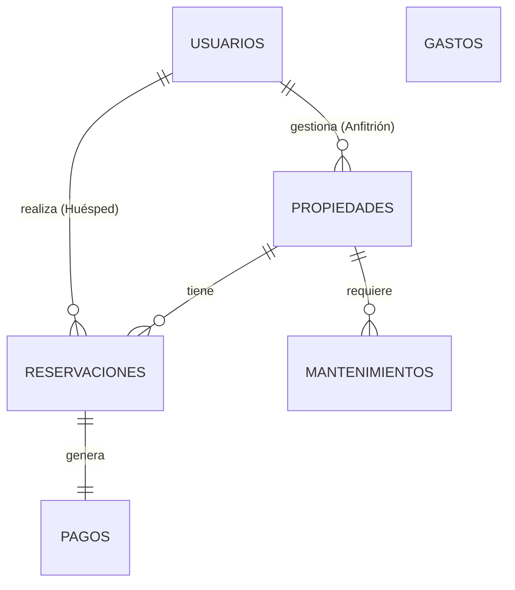

# Modelo Relacional del Sistema Airbnb

Este documento describe la estructura de la base de datos, las tablas y sus relaciones dentro del sistema de gestión empresarial.

## Diagrama de Entidad-Relación (ER) Simplificado

## Diccionario de Datos

### 1. Tabla: `usuarios`
Almacena la información de todos los usuarios del sistema, diferenciados por tipo (Huésped o Anfitrión).

| Campo | Tipo | Descripción | Clave |
| :--- | :--- | :--- | :--- |
| `id` | Integer | Identificador único del usuario. | PK |
| `nombre` | String | Nombre(s) del usuario. | |
| `apellido` | String | Apellidos del usuario. | |
| `tipoUsuario` | String | Rol del usuario: "Huésped" o "Anfitrión". | |
| `telefono` | String | Número de contacto. | |
| `email` | String | Correo electrónico (usado para login). | |
| `fechaRegistro` | Date | Fecha de alta en el sistema. | |
| `datosBancarios` | Object | (Opcional) JSON con `banco`, `clabe`, `titular`. Solo para Anfitriones. | |

### 2. Tabla: `propiedades`
Catálogo de inmuebles disponibles para renta.

| Campo | Tipo | Descripción | Clave |
| :--- | :--- | :--- | :--- |
| `id` | Integer | Identificador único de la propiedad. | PK |
| `nombre` | String | Nombre comercial de la propiedad. | |
| `direccion` | String | Dirección completa. | |
| `zona` | String | Zona o barrio (ej. Polanco, Roma). | |
| `ciudad` | String | Ciudad de ubicación. | |
| `tipoPropiedad` | String | Tipo (Casa, Depto, Loft, etc.). | |
| `capacidad` | Integer | Número máximo de personas. | |
| `precioNoche` | Decimal | Costo por noche en MXN. | |
| `estatus` | String | Estado actual: "Disponible", "Mantenimiento", etc. | |
| `idAnfitrion` | Integer | ID del usuario propietario/anfitrión. | FK -> usuarios.id |
| `imagen` | String | URL de la fotografía principal. | |

### 3. Tabla: `reservaciones`
Registro de las estancias reservadas por los huéspedes.

| Campo | Tipo | Descripción | Clave |
| :--- | :--- | :--- | :--- |
| `id` | Integer | Identificador único de la reservación. | PK |
| `idHuesped` | Integer | ID del usuario que reserva. | FK -> usuarios.id |
| `idPropiedad` | Integer | ID de la propiedad reservada. | FK -> propiedades.id |
| `fechaInicio` | Date | Fecha de check-in. | |
| `fechaFin` | Date | Fecha de check-out. | |
| `noches` | Integer | Duración de la estancia. | |
| `tarifaNoche` | Decimal | Precio por noche al momento de reservar. | |
| `montoTotal` | Decimal | Costo total de la reserva. | |
| `estadoReserva` | String | "Confirmada", "Cancelada", "Completada", "Activa". | |
| `notas` | String | Comentarios adicionales. | |

### 4. Tabla: `pagos`
Control de ingresos generados por las reservaciones y su dispersión a anfitriones.

| Campo | Tipo | Descripción | Clave |
| :--- | :--- | :--- | :--- |
| `id` | Integer | Identificador único del pago. | PK |
| `idReserva` | Integer | ID de la reservación asociada. | FK -> reservaciones.id |
| `fechaPago` | Date | Fecha en que se recibió el pago. | |
| `montoBruto` | Decimal | Monto total pagado por el huésped. | |
| `comisionAirbnb` | Decimal | Comisión retenida por la plataforma. | |
| `montoNeto` | Decimal | Monto a dispersar al anfitrión (`montoBruto` - `comision`). | |
| `metodoPago` | String | Forma de pago (Tarjeta, Transferencia, etc.). | |
| `estadoPago` | String | "Pagado", "Pendiente", "Reembolsado". | |
| `estadoDispersado` | Boolean | Indica si ya se pagó al anfitrión. | |
| `fechaDispersion` | Date | Fecha de transferencia al anfitrión. | |

### 5. Tabla: `mantenimientos`
Registro de servicios de limpieza y reparaciones realizados a las propiedades.

| Campo | Tipo | Descripción | Clave |
| :--- | :--- | :--- | :--- |
| `id` | Integer | Identificador único del mantenimiento. | PK |
| `idPropiedad` | Integer | ID de la propiedad atendida. | FK -> propiedades.id |
| `tipo` | String | "Limpieza", "Preventivo", "Correctivo". | |
| `descripcion` | String | Detalle del trabajo realizado. | |
| `fechaProgramada` | Date | Fecha de ejecución. | |
| `costoBase` | Decimal | Costo del proveedor. | |
| `comisionPlataforma` | Decimal | Margen de ganancia de la empresa. | |
| `totalCobrado` | Decimal | Total cobrado al anfitrión (`costoBase` + `comision`). | |
| `estatus` | String | "Programado", "En proceso", "Completado". | |

### 6. Tabla: `gastos`
Registro de gastos operativos de la empresa (no vinculados directamente a una propiedad).

| Campo | Tipo | Descripción | Clave |
| :--- | :--- | :--- | :--- |
| `id` | Integer | Identificador único del gasto. | PK |
| `fecha` | Date | Fecha del gasto. | |
| `categoria` | String | Clasificación (Marketing, Software, Nómina, etc.). | |
| `descripcion` | String | Detalle del gasto. | |
| `proveedor` | String | Nombre del proveedor. | |
| `monto` | Decimal | Subtotal del gasto. | |
| `iva` | Decimal | Impuesto al Valor Agregado. | |
| `totalConIVA` | Decimal | Total pagado. | |
| `estatus` | String | "Pagado", "Pendiente". | |
